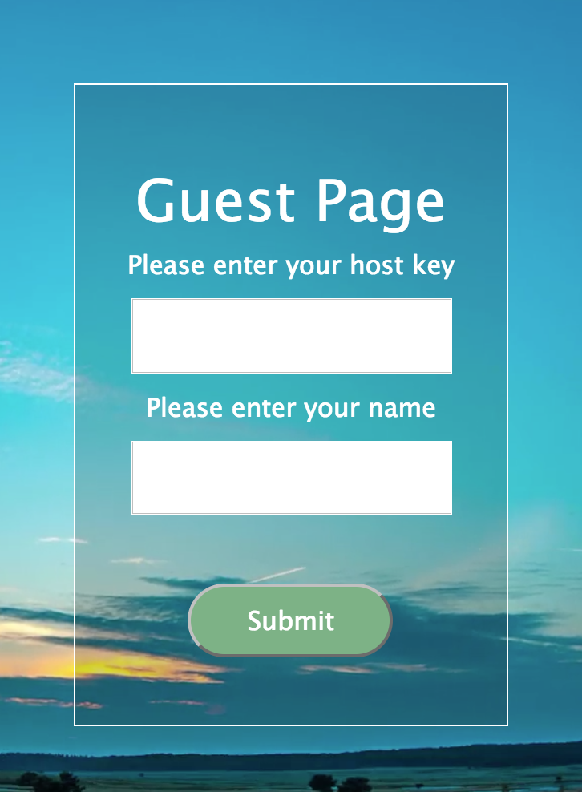

# AirSpace

AirSpace is a group response platform that allows group members to provide feedback and answer a host user's questions.
Group members can initiate or join existing sessions via phone, tablet, or computer by going to the AirSpace website and
entering their host's unique passport key. The host can then send surveys and view member responses in real time.

## Authors

* **Aaron Sosa** - [aarontsosa](https://github.com/aarontsosa)
* **Tim Brady** - [tfb414](https://github.com/tfb414)
* **Nat Ventura** - [nat-ventura](https://github.com/nat-ventura)

## Built With

* Node.js
* Express
* WebSockets
* JavaScript ES6
* jQuery 3.2.1
* HTML5/CSS3

## Installation Requirements

## Walkthrough

When a user visits [41r5p4c3.com or whatever domain we can get our hands on], they will be prompted to select their user type: Host or Guest.

A Host can be a teacher, team leader, presenter, or just the guy at the kickback who loves a good party game.
A Guest can be a student, team member, an audience member, or a skeptical party guest along for the ride.

A Host will be assigned a unique passport key after selecting "Host" on the front page. They will then have the option to create a survey.

After creating a survey, Hosts should then share their unique passport key with their intended Guests.

In other words, if you want someone to take your quiz or join your party game, you have to let them know what your unique passport key is, so that they can enter it on the Guest Page.

Once a Guest enters the Host's passport key on the Guest Page, they will either be directed to the Host's active survey, or to the
Waiting Room. If the Host has not activated a survey, their Guests will remain in the Waiting Room until the Host activates a survey.
[**insert picture of survey activation toggle**]
Hosts can also activate already-existing surveys previously created under their unique passport key.

Once Guests are brought to a survey page, they can fill out their answers and submit the survey to the Host in real time.
The Host will be able to view Guest submissions on their Host Dashboard as they come in.
[**insert picture of Host Dashboard page**]

The rest is up to the Host!

**//Give further explanation of what will happen if it's a quiz, or a party game.**

Our hope is that AirSpace will facilitate group communication in all kinds of different contexts--
work, play, and learning.

### Host Instructions

### Guest Instructions

## Development Process
* [1. Concept]
* [2. Initial Planning]
* [3. Database Architecture]
* [4. Structuring User Interface]
* [5. Challenges and Successes]

### 1. Concept

We developed AirSpace with the intention of creating a multipurpose space where host users could poll other users and send information
back and forth instantly.

We'd seen digital audience response systems like this in videogames (like popular party quiz games) and lecture halls (using "clickers"), but not in the form of a portable app that could be easily accessed on mobile, without requiring any kind of extra hardware or software.

### 2. Initial Planning

[8-11-17]

We brainstormed what we wanted a barebones version of the application to look like, and ended up creating a list of first steps to implement:

* Set up a simple system allowing messages to send back and forth between two servers
* Create basic HTML pages for users to submit and receive information
* Create tables (`can't believe we really thought this deserved only one bullet point...`)
* Send and receive "questions" first, and later expand to a collection of questions in the form of a survey, etc.

We decided to begin working on a structure with two servers exchanging messages via WebSockets. Then we would have a separate "Question Handler" js file that would deal with the information inside of those messages. The handler would have methods such as `.getQuestionId()`, `.getAnswer()`, and `.serialize()`.

### 3. Database Architecture

The "Question Handler" file that we'd anticipated in our initial plans later became our `managedatabase.js` file.

### 4. Structuring User Interface

### 5. Challenges and Successes

## Closing Thoughts

## License 
Copyright <2017> <Aaron Sosa, Tim Brady, Nat Ventura>

Permission is hereby granted, free of charge, to any person obtaining a copy of this software and associated documentation files (the "Software"), to deal in the Software without restriction, including without limitation the rights to use, copy, modify, merge, publish, distribute, sublicense, and/or sell copies of the Software, and to permit persons to whom the Software is furnished to do so, subject to the following conditions:

The above copyright notice and this permission notice shall be included in all copies or substantial portions of the Software.

THE SOFTWARE IS PROVIDED "AS IS", WITHOUT WARRANTY OF ANY KIND, EXPRESS OR IMPLIED, INCLUDING BUT NOT LIMITED TO THE WARRANTIES OF MERCHANTABILITY, FITNESS FOR A PARTICULAR PURPOSE AND NONINFRINGEMENT. IN NO EVENT SHALL THE AUTHORS OR COPYRIGHT HOLDERS BE LIABLE FOR ANY CLAIM, DAMAGES OR OTHER LIABILITY, WHETHER IN AN ACTION OF CONTRACT, TORT OR OTHERWISE, ARISING FROM, OUT OF OR IN CONNECTION WITH THE SOFTWARE OR THE USE OR OTHER DEALINGS IN THE SOFTWARE.
